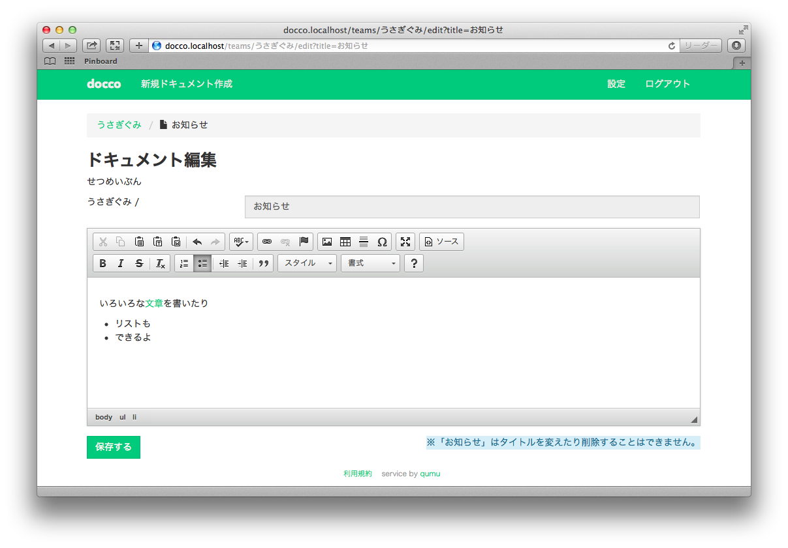

# docco

## どんなもの？

チームでドキュメントを共有するためのサービスです。

Qiita:TeamとかWikiとか便利なのだけれど、エンジニア以外の人に気軽に使ってもらいづらいなと思う機会が最近多く、WordPressやブログの編集画面をイメージして気軽に文章を書けるようにしてみようと思いました。
社内ブログとか日報のようなフロー的なものでなく、ストックとして、チームの資産としてドキュメントを地道に蓄積していけるものを目指してます。例えば会社内でのナレッジ共有とかに使ってもらえるとうれしいなと。

ちなみに将来的に有料プランを用意したいです。

## スクリーンショットとか

## メンバー
- @hiro_y
- @zk33
