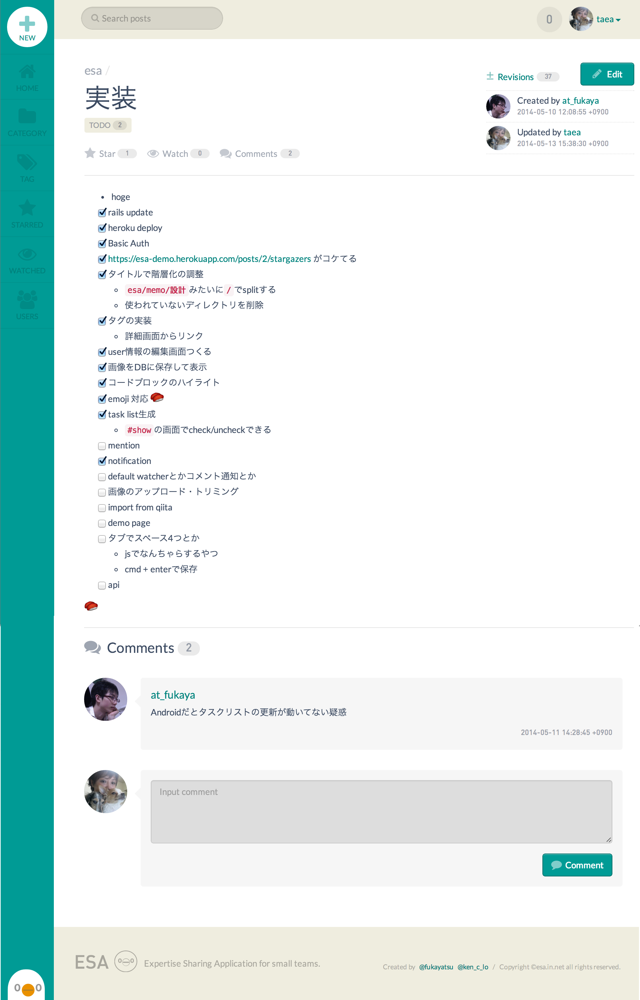
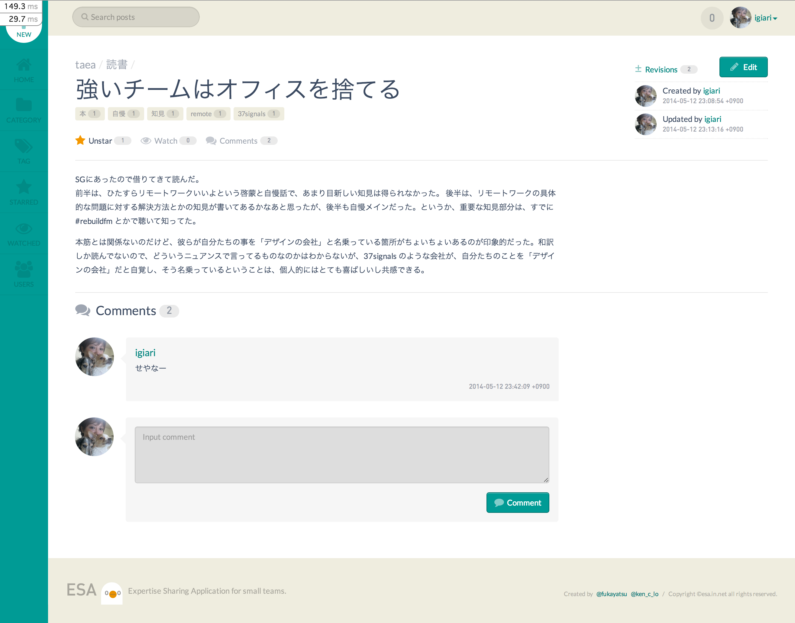
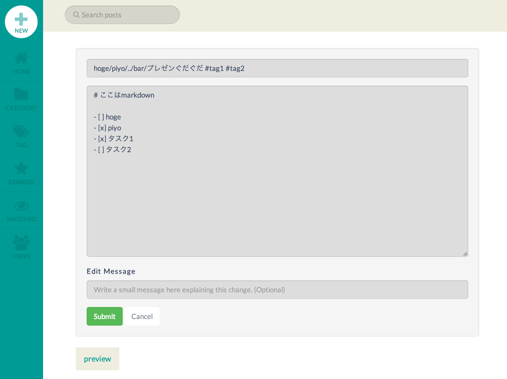

# ESA
### ESA(餌) is an Expartise Sharing Application for small teams.

## どんなもの？
小さな開発チームのための、ドキュメント共有サービスです。
ドキュメントを気軽にシェアできるだけでなく、Wiki のようなディレクトリ管理もラクにできるので、必要なドキュメントにすぐにアクセスできるように整理ができます。
作られたドキュメントは、チーム内の誰でも更新することができます。
ホスティングサービスは行わず、利用するチームで Heroku 等に各自デプロイしてセルフホスティングしてもらうのがヨサソウ。ローカル環境でも動くよ！

### その他実装（予定含む）機能とか
- Google OAuthでログイン
- 記事タイトルを ```category1/category2/title``` と書くと、自動的にカテゴリの階層が作られる
- 記事タイトルに ```title #tag1 #tag2``` と書くと、#の部分がタグになる
- リビジョンで diff が Gitっぽく見れる
- GitHubライクな ```- [ ]``` のチェックボックスでタスク管理
- Emoji :sushi:
- チームごとに Private なTwitterアカウントを用意して、そこから通知
- HipChat, Idobata 連携


## スクリーンショットとか






## メンバー
- @fukayatsu
- @ken_c_lo
