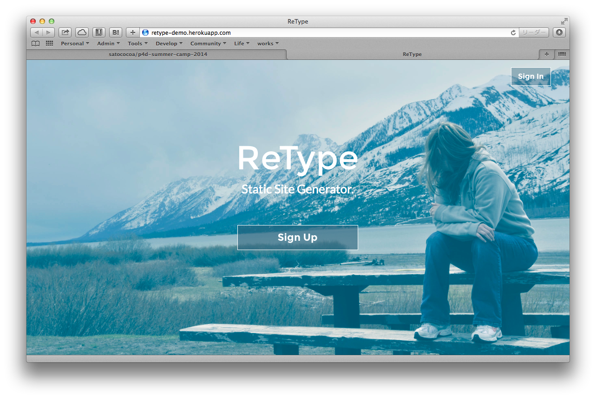
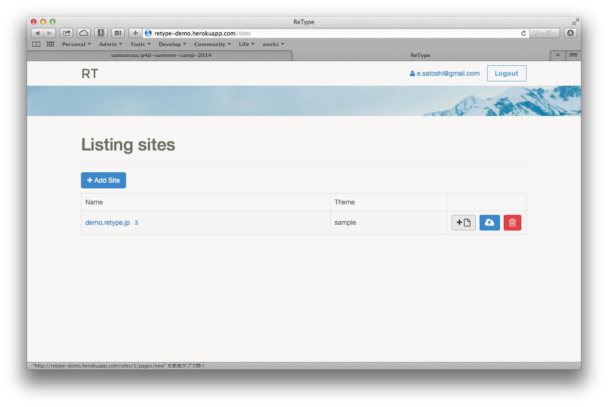

# ReType

## どんなもの？
- [ReType](https://github.com/satococoa/retype)

静的ページを生成する CMS です。

「middleman に管理画面があったら便利だよね」というニーズから出発しているので、
json データを編集することで簡単にコンテンツを編集できるようになっています。

また、ブラウザ上から S3 または FTP でデプロイすることができます。

企業サイト等の仕事をやるとき、WordPress だとメンテが面倒だし、middleman だと
更新をお客さんに任せるにはちょっと敷居が高い。

そんなニーズに ReType はぴったりだと思います。

あとはエンジニアのポートフォリオを作れるテンプレートをバンドルして、
GitHub Pages にデプロイできるようにすると最初はエンジニアに使ってもらえそう。

## スクリーンショットとか

## メンバー
- @machida
- @satococoa
